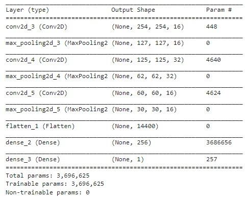

# Potato image classifier (CNN)
### **I love potatoes** :potato:  
I wanted to make a model that would correctly classify an image as being a potato or not.  
I used `Tensorflow` as the framework for ther deep learning model, the actual model is a `CNN (Convulutional Neural Network)` as they give the best results when working with images.  

#### CNN architecture

As you can see above it's a small 9 layered model as I used a very small set of data to train it, so this gave the best results as the bigger the model the more data it needs to produce optimal results.  
